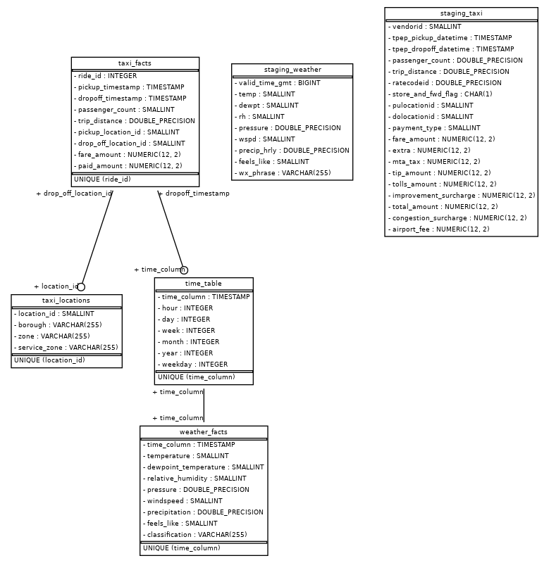

# Udacity capstone project for data engineering 

I would like to find some relationships between the weather and taxi rides in New York. Therefore, I found two datasets:
* [The trip record data for the yellow cabs in NYC](https://www.nyc.gov/site/tlc/about/tlc-trip-record-data.page)
* [Hourly weather data as measured at Laguardia Airport in NYC](https://www.wunderground.com/history/daily/us/ny/new-york-city/KLGA/date/2021-01-01)

The goal is to run an analytical query that can tell us if the amount of trips increases when it is raining or not. From there, we would like to delve deeper, e.g., assess the effect of rush hour on the amount of trips when it is raining. Thus, the goal is to build a database that facilitates analysis.

## Technologies used
The technologies were chosen and used in the following order:

* First, to stage the raw data, S3 was used for storage as it is easy to set up compared to HDFS.
* From there, the choice would be to either use Spark to wrangle the data or simply Redshift. In this case, I chose to use Redshift, as it is easy to set up, scales linearly, and can be used as the database for analysis as well. Spark, in this case, would be overkill, as we are not doing complex transformations that Redshift cannot handle.
* Finally, we use python to execute the ETL, as we can simply transform it to Airflow if we were to schedule our pipeline.

## How to use

Do as follows:

1. Create a Redshift cluster by running `sh create_cluster.sh` in the terminal.
2. Fill in all details in the `config_example.cfg` file and rename to `config.cfg`.
3. Run `python taxi_and_weather_etl.py` from the terminal and check its output.
4. Enjoy!

## Data assesment

The data was assesed in the file `data_exploration.ipynb`.

## ETL pipeline

For the pipeline we'll undertake the following process:

1. We stage the data in S3 in CSV format.
2. We import the data from S3 into Redshift using staging tables.
3. We do some data checks to ensure that the import went well.
4. We do transformations to obtain our data model for our analyses.

## Data model

For the data model, we used the ERD as given below.

Thus, we first stage the data untouched in Redshift. We create two tables:

* `staging_weather`, which contains the raw weather data.
* `staging_taxi`, which contains the raw taxi data.

Second, we can directly import the CSV for the location IDs in one table:

* `taxi_locations`, which contains information about the location IDs used in the columns: pickup_location_id and drop_off_location_id of the `staging_taxi` table.

From there, we do some transformations to obtain the following tables:

* `taxi_facts`, which contains the taxi data that we need to perform our analysis from the `staging_taxi` table with an additional identification column. In this table, we dropped the rows that had a negative fare_amount or total_amount.
* `weather_facts`, which contains the weather data that we need to perform our analysis from the `staging_weather` table.
* `time_table`, which contains all of the timestamps from the `taxi_facts` and `weather_facts` table in specific units.

Finally, we also create a view in which we combine the `taxi_facts` and `weather facts` table:

* `taxi_weather_facts`, which joins the `taxi_facts` table with the `weather_facts` table based on the proximity of pickup_timestamp and time_column (the closer the better). We do one join per row in the `taxi_facts` table.

## Data dictionary

Here, we provide a simpel data dictionary for all tables except the staging tables.

* `time_table`

|Column name|Description|
|-|-|
|time_column|Timestamp in NYC time|
|hour|The hour of the timestamp in 24 hours|
|day|The day of the month from 1 to 31|
|week|The week of the timestamp from 1 to 52|
|month|The month of the timestamp from 1 to 12|
|year|The year of the timestamp, e.g., 2022|
|weekday|The weekday of the timestamp: 0 is Sunday and 6 is Saturday|

* `taxi_locations`

|Column name|Description|
|-|-|
|location_id|The unique location ID|
|borough|The borough of the location in NYC|
|zone|The zone within the borough of the location|
|service_zone|The name of the service zone for rates at the location|

* `taxi_facts`

|Column name|Description|
|-|-|
|ride_id|Unique identifier for a ride.|
|pickup_timestamp|Timestamp in NYC time at which the passenger(s) were picked up.|
|dropoff_timestamp|Timestamp in NYC time at which the passenger(s) were dropped off.|
|passenger_count|The amount of passengers in a ride. Can be NULL if not filled in by the driver.|
|trip_distance|The distance of the trip in miles.|
|pickup_location_id|The location ID of where the passenger(s) were picked up.|
|drop_off_location_id|The location ID of where the passenger(s) were dropped off.|
|fare_amount|The cost of the trip as measured by the taxi meter.|
|paid_amount|The amount actually paid by the passenger. The difference with the fare_amount is the tip.|

* `weather_facts`

|Column name|Description|
|-|-|
|time_column|Timestamp in NYC time of when the observation was made.|
|temperature|The temperature as measured in degrees Celsius.|
|dewpoint_temperature|The dewpoint temperature as measured in degrees Celsius.|
|relative_humidity|The relative humidity as measured in a percentage.|
|pressure|The pressure as measured in pascal.|
|windspeed|The windspeed as measured in m/s.|
|precipitation|The precipitation as measured in millimeters.|
|feels_like|The feels like temperature as expressed in degrees Celsius.|
|classification|A classification of the weather conditions, e.g., cloudy or rainy.|

## Analysis

From here, we can finally perform our analysis to find out if rain has an effect on the amount of rides per hour. We do so by executing the following query:

~~~~sql
SELECT rain,
    sum(counts)/count(hour) as rides_per_hour
FROM (
    SELECT 
        count(a.pickup_timestamp) as counts,
        a.precipitation > 0 as rain,
        b.hour,
        b.day,
        b.month,
        b.year
    FROM taxi_weather_facts a, time_table b
    WHERE a.pickup_timestamp = b.time_column
    GROUP BY rain, b.hour, b.day, b.month, b.year
)
GROUP BY rain
~~~~

This results in the table below.

|rain|rides_per_hour|
|-|-|
|true|1434|
|false|1788|

We find that there are less rides on average when there is rain then where there is rain, which corresponds to the conclusion of [this paper](https://www.ncbi.nlm.nih.gov/pmc/articles/PMC5584943/). However, the paper also states that rush-hour makes a difference, which we leave up to the reader to find out.

## Scheduling of pipeline 

For further development, Airflow could be incorporated to run this pipeline on a monthly basis. If we wish to run this pipeline every day, we could obtain the taxi dataset each day from [NYC OpenData](https://data.cityofnewyork.us/browse?Dataset-Information_Agency=Taxi+and+Limousine+Commission+%28TLC%29&). The weather data can be obtained from the API as we currently do on a daily basis. The ETL script can easily be implemented in Airflow, as it is structured as a DAG.

## Scaling up under different scenarios

Let's assess the following scenarios:

Q: What if the data was increased by 100x?\
A: Redshift could easily accomodate 100x the data if we scale the nodes of the cluster as the table data is distributed by making use of `diststyle`, `distkey` and `sortkey` where necessary to ensure optimal query performance. Alternatively, as we are currently staging the data on S3, we could use S3 as a data lake and transform the data from there using Spark. Another alternative would be to use the Hadoop ecosystem to run map-reduce jobs to transform the data and to execute the queries. In those cases, we could use Hive or Trino to do the analyses. Do take in mind that this would be much slower than using Spark or Redshift to do the transformations.

Q: What if the pipeline were run on a daily basis by 7am?\
A: In that case, we would obtain the weather and taxi data from the day before as explained in the heading *Scheduling of pipeline*. We could simply append the data to the facts table and reload the dimension tables. In addition, we could set SLAs in Airflow to ensure that our pipelines finish within the specified time. If not, we can scale out our Redshift cluster or move to Spark for data processing. 

Q: What if the database needed to be accessed by 100+ people?\
A: Redshift could accomodate this as it is a database made for this purpose (OLAP). As the data is distributed in specific ways to ensure optimal performance, analytical queries by 100+ people should not be any problem. Alternatively, we could use Spark to transform the data and write it back to S3. From there, anyone can use software that has schema-on-read functionality to do any analysis. For example, we could use a Hive metastore in combination with Spark to build a Spark warehouse. If Spark is too heavy for the job, we might use Trino to facilitate analytical queries, which can also read the metadata from the Hive metastore.

## Contributing
Pull requests are welcome. For major changes, please open an issue first to discuss what you would like to change.

Please make sure to update tests as appropriate.

## License
[MIT](https://choosealicense.com/licenses/mit/)